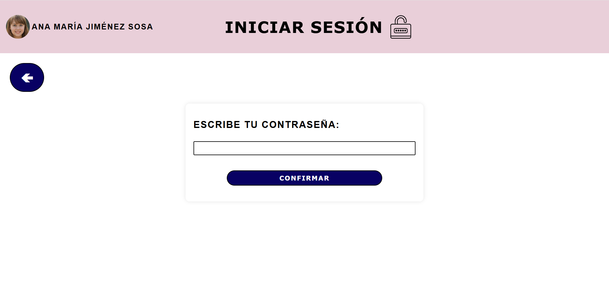
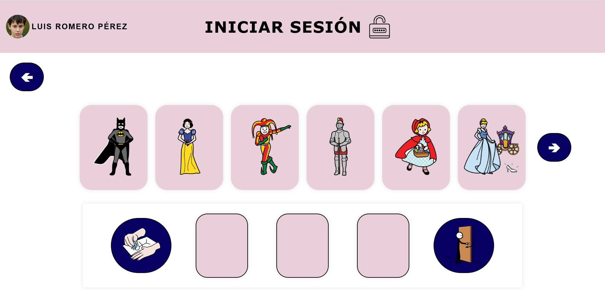
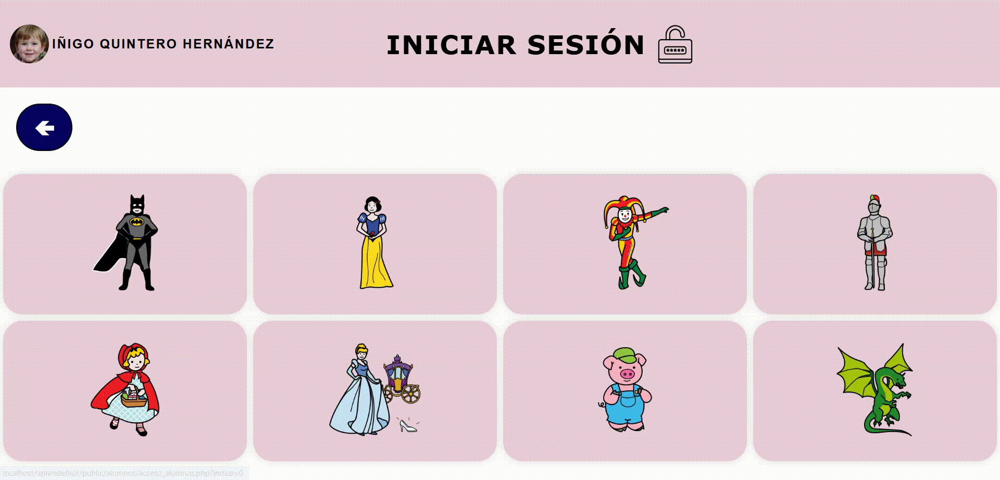
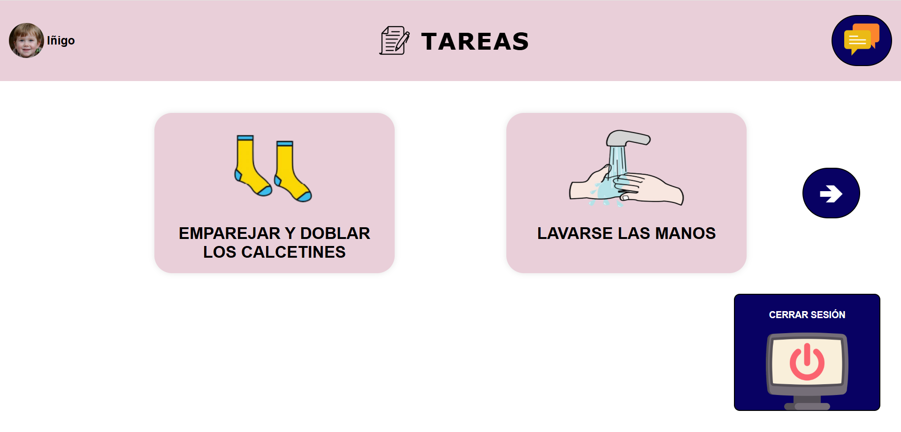
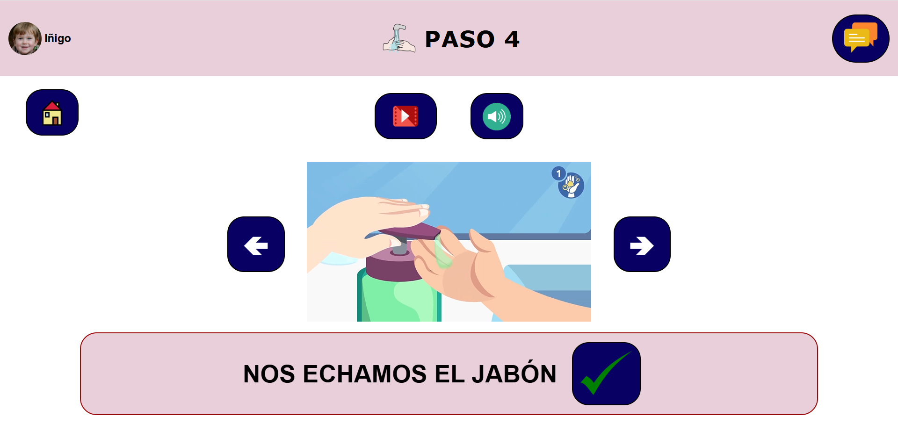
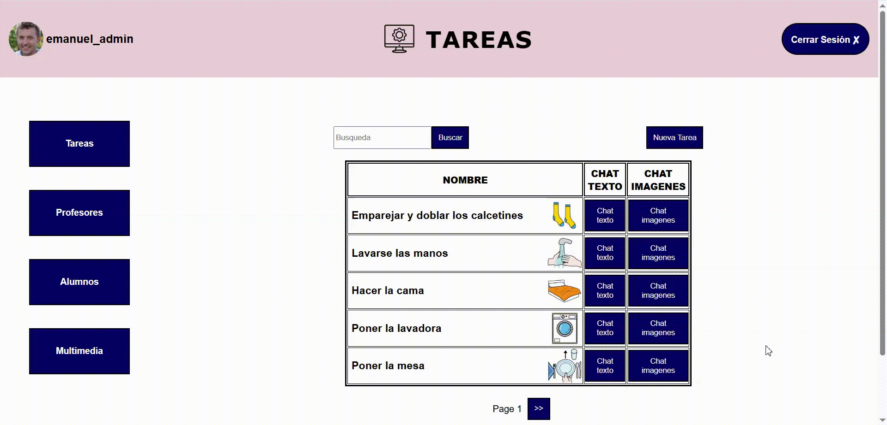
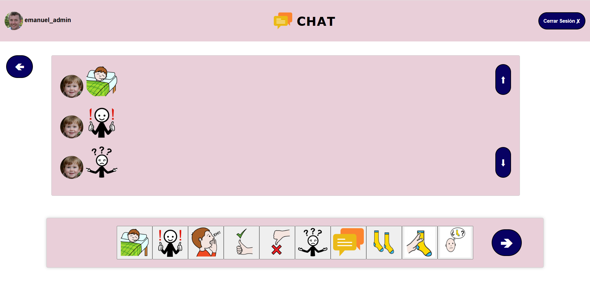
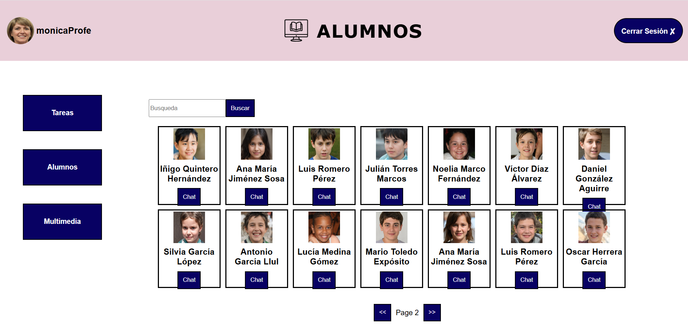
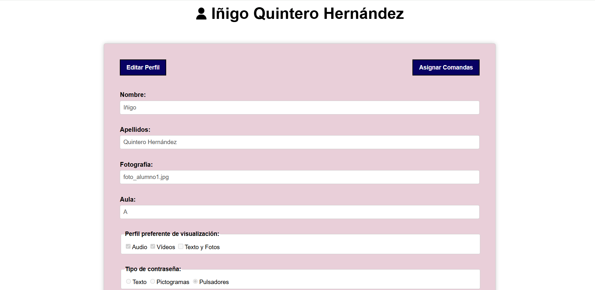
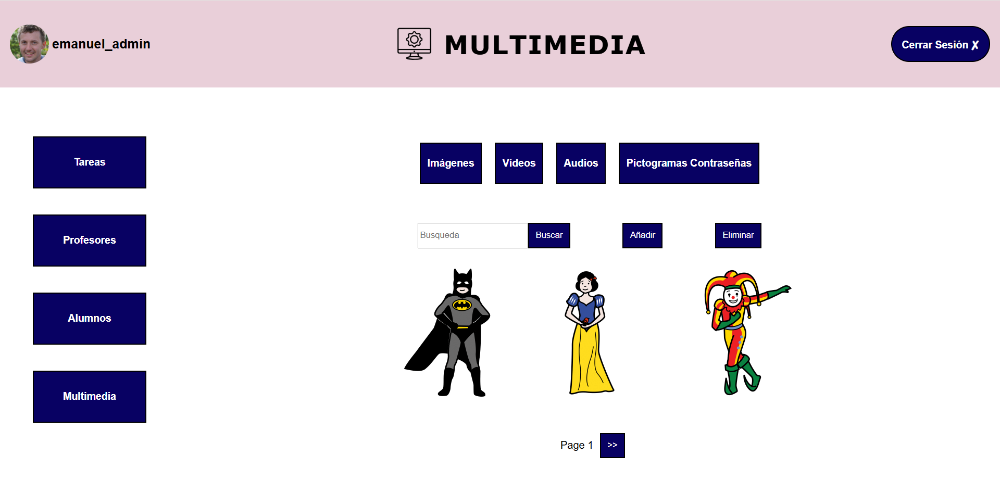

Piloto de una plataforma web de **apoyo educativo** para un colegio de niños con **necesidades especiales**. El proyecto está destinado a ayudar **alumnos de entre 3 y 21 años con diversidad funcional** a ganar independencia mediante agendas visuales, tareas adaptadas, rutinas flexibles y comunicación directa con los educadores.

## 📄 Descripción del proyecto

**Aprendefacil** es una plataforma diseñada para el **Colegio de Educación Especial San Rafael** para gestionar agendas individualizadas y actividades educativas adaptadas. Permite:

    

- **A educadores y administradores**

    - Crear y monitorear tareas

    - Asignar roles (existen diferentes estudiantes encargados de tareas específicas)

    - Administrar peticiones (comandas, materiales escolares o fotocopiadora/plastificado)

    - Gestionar contenido educativo (pictogramas, audios y vídeos)

- **A alumnos**

    - Seguir y realizar tareas

    - Recibir alertas personalizadas de tareas pendientes

    - Interfaces adaptadas a sus necesidades especiales

    - Subir evidencias (vídeo o foto para mostrar el resultado de la tarea)
    
    - Comunicarse con los profesores de forma personal y a través de un chat asociado a una tarea

> [!NOTE]  
> Para información más detallada sobre los requerimientos del proyecto [consultar el Pliego Técnico](doc/Pliego_Tecnico.md).

## 🛠️ Características principales

## 🚪 Login de alumnos

Para facilitar el inicio de sesión y cumplir con los protocolos de accesibilidad dados por el centro, se ha eliminado por completo el concepto del campo `usuario` y los alumnos **acceden a su perfil eligiendo la tarjeta que contiene su nombre y su cara** de la página de inicio. Además, permitimos que a cada alumno se le asigne su **modo preferente de visualización** en el login: texto (contraseña), pictogramas (secuencia visual) o barrido (scanning + pulsador).

### Login con texto

- El alumno introduce una **contraseña/clave sencilla**, normalmente asociada a alguno de sus gustos o aficiones personales, elegida por sus educadores.

- Importante como fallback universal y para **perfiles con mayor capacidad cognitiva**.

    

### Login con pictogramas

- El usuario se autentica seleccionando una **secuencia determinada de tres pictogramas**.

- Existe un indicador de la secuencia seleccionada, los pictogramas seleccionados pueden deseleccionarse con facilidad y la confirmación de la secuencia se produce de forma manual (pulsando un botón).

- **Ideal para alumnos con dificultades de lectura** o problemas cognitivos.

    

### Login con barrido

- En la interfaz (UI) se recorren elementos interactuables (pictogramas) en un orden y velocidad configurable, de forma que un **pulsador externo** (o tecla grande) puede seleccionar con facilidad el elemento activo.

- Seleccionar el pictograma correspondiente permite iniciar sesión al estudiante.

- Es **crítico para alumnos con movilidad reducida** que no pueden usar una pantalla táctil convencional.

    

---

## 📋 Agenda de tareas

- **Núcleo operativo** del alumno, con organización visual y secuenciada de su agenda.

- Aquí se muestran las **tareas asignadas**, los chats de comunicación directa con los profesores y las posibles alertas de las tareas pendientes.

    

- Para cada tarea hay una **guía paso a paso de su ejecución**, se puede marcar cada paso como hecho o no hecho, subir evidencias, pedir ayuda, utilizar el chat general de la tarea y ver el progreso.

- El contenido multimedia disponible en cada paso está **adaptado al perfil de visualización** del alumno.

    

---

## 💬 Chats de tarea / comunicación directa

- Los chats de las tareas son **conversaciones vinculadas a cada tarea** concreta para discutir progreso, dudas o adjuntar evidencias.

- Cada alumno y educador tiene también **chats de comunicación directa** para apoyo, avisos o consultas puntuales.

### Chat de texto

- Chat estándar que utiliza **texto como medio para la comunicación**, ya sea en el chat de una tarea o en un chat de comunicación directa.

    

### Chat de imágenes

- Chat pictográfico utilizado para **alumnos con necesidad de evidencia visual**, soportado tanto en el chat de una tarea como en el chat de comunicación directa.

- En las imágenes disponibles para la comunicación se encuentran pictogramas de tareas, **materiales de la escuela**, indicadores de respuesta, iconos de decisión y pictogramas de comunicación.

    

---

## ✍️ Gestión de tareas

- El administrador y el educador pueden ver el **catálogo completo de tareas**, buscar una, aplicar filtros y acceder a los chats en formato texto y en formato imágenes de cada una.

- Hay disponibles **batch actions**, como publicar la tarea a varios alumnos o aulas, clonar y versionar tareas concretas.

    

- El administrador con ayuda del educador puede **crear tareas reutilizables** (usando plantillas) y tareas específicas para un alumno en concreto.

- Dentro de una tarea se puede editar el título, la descripción, **los pasos ordenables y la multimedia asociada** (pictogramas, audios o vídeos según corresponda) y es posible establecer responsables y plazos y monitorizar su ejecución.

    

---

## 🧒 Gestión de alumnos

- El administrador puede gestionar el perfil de cada alumno, **asignar roles** y editar su información.

- Los educadores pueden **revisar el perfil** y **acceder al chat personal** de cada alumno (según las preferencias del estudiante este chat será de tipo texto o de tipo imágenes).

    

- Cada perfil del alumnado cuenta con sus datos básicos, **preferencias de visualización**, aula, contactos fuera del centro, **parámetros del login**, configuración de barrido (si aplica) e historial de consentimientos y autorizaciones.

    

---

## 🗃️ Gestión de multimedia

- El administrador puede almacenar, editar y gestionar todo el contenido multimedia de la web: audios, **vídeos de instrucciones**, fotos, evidencias y **pictogramas (ARASAAC)** de tareas, chat o login.

- El sistema permite **subidas masivas** con mapeo de etiquetas y asignación directa a tareas.

    

## 🎨 Esquema de colores

| Descripción       | Color                                                     | Hex       | RGB                |
| ----------------- |:---------------------------------------------------------:|:---------:|:------------------:|
| Header            |  | `#e9cfd9` | `rgb(233 207 217)` |
| Fondo             |  | `#fcfcfc` | `rgb(252 252 252)` |
| Fondo 2           |  | `#e9cfd9` | `rgb(233 207 217)` |
| Texto             |  | `#111810` | `rgb(17 24 16)`    |
| Botones           |  | `#080163` | `rgb(8 1 99)`      |
| Texto botones     |  | `#fcfcfc` | `rgb(252 252 252)` |

| Contraste de color (WCAG 2)                   | Foreground | Background | Ratio   | AA (normal) | AA (grande) | AAA |
| --------------------------------------------- |:----------:|:----------:|:-------:|:-----------:|:------------:|:---:|
| Texto sobre Fondo                             | `#111810`  | `#fcfcfc`  | 17.62:1 |      ✅     |       ✅     |  ✅ |
| Texto sobre Header / Fondo 2                  | `#111810`  | `#e9cfd9`  | 12.39:1 |      ✅     |       ✅     |  ✅ |
| Texto botones sobre Botones                   | `#fcfcfc`  | `#080163`  | 17.13:1 |      ✅     |       ✅     |  ✅ |
| Botones sobre Fondo                           | `#080163`  | `#fcfcfc`  | 17.13:1 |      ✅     |       ✅     |  ✅ |
| Botones sobre Header                          | `#080163`  | `#e9cfd9`  | 12.04:1 |      ✅     |       ✅     |  ✅ |

## ⚖️ Licencia y uso

Este proyecto forma parte de un trabajo desarrollado para el Colegio de Educación Especial Clínica San Rafael dentro del proyecto
de innovación docente: _“22-95 AppRendo solo: Aprendizaje-servicio transversal para desarrollo de software accesible”_. La autoría es compartida entre el equipo de desarrollo y el centro peticionario. Por tanto, el repositorio se mantiene aquí únicamente con fines de exposición de la solución técnica y el cumplimiento de los requisitos de accesibilidad.

### Autores:

- **Emanuel Giraldo Herrera** — Miembro del equipo de desarrollo / Auditor de accesibilidad

- **Otros miembros del equipo** — No disponibles en este repositorio por cuestiones de privacidad

- **Colegio de Educación Especial San Rafael** — Peticionario / Copropietario

Cualquier uso, reproducción, modificación o utilización comercial del código requiere autorización expresa y por escrito de todas las partes. Para más información consultar la [licencia](LICENSE).

## 🤝 Agradecimientos

- [Universidad de Granada](https://www.ugr.es/)
- [Colegio de Educación Especial Clínica San Rafael](https://www.sjdgranada.es/)
